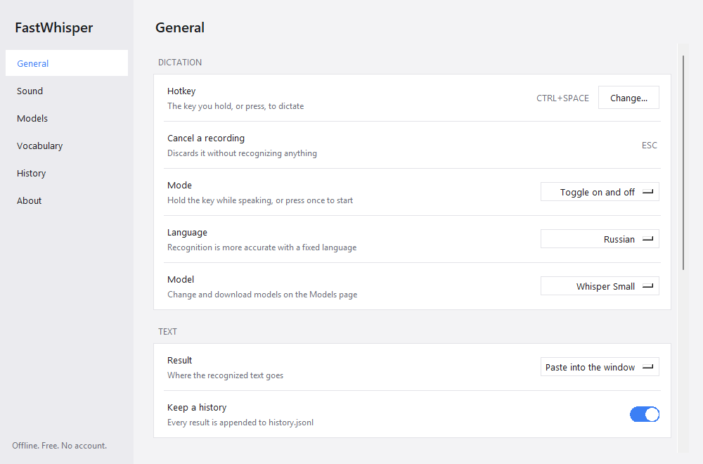
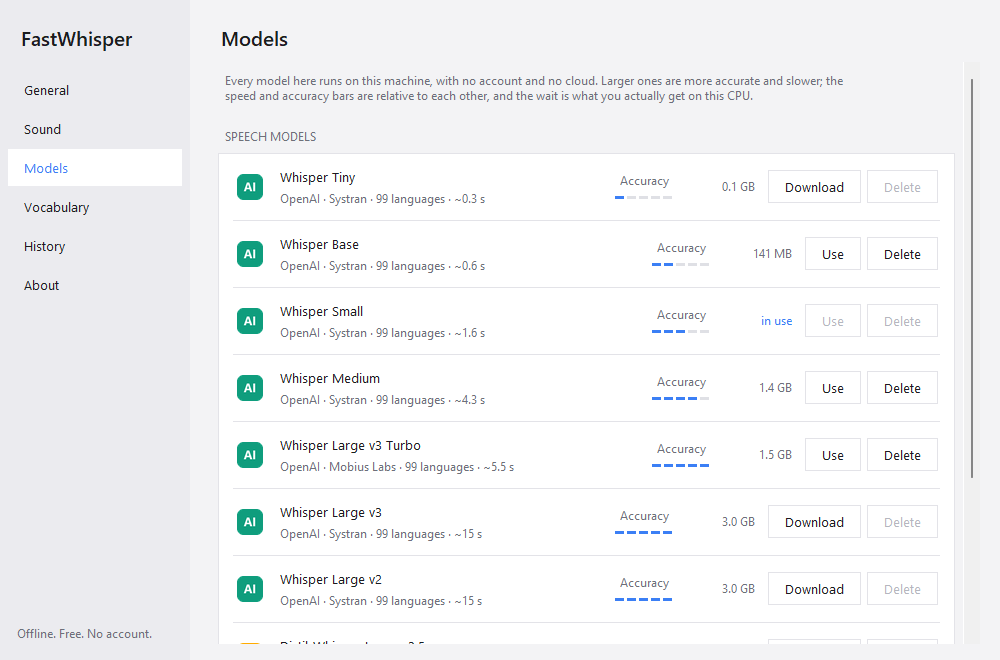

<p align="center">
  
</p>

<p align="center">
  <b>Dictation for Windows that runs on your own machine.</b><br>
  Press a key, speak, press it again - the text appears in whatever window you were typing in.
</p>

<p align="center">
  <a href="https://github.com/avl55-labs/fast-whisper/releases/latest">
    </a>
  <a href="https://github.com/avl55-labs/fast-whisper/releases">
    </a>
  <a href="LICENSE">
    </a>
  
  
</p>

<p align="center">
  <a href="#quick-start">Quick start</a> ·
  <a href="#settings">Settings</a> ·
  <a href="#choosing-a-model">Models</a> ·
  <a href="#for-organisations">For organisations</a> ·
  <a href="CHANGELOG.md">Changelog</a>
</p>

<p align="center">
  
</p>

## Quick start

1. Download the installer from [Releases][rel] and run it. No administrator rights, no UAC
   prompt.
2. On the first launch it asks which speech model to use, with what each one costs in
   waiting and in disk. The recommended one is picked for you.
3. Put your cursor where you want the text, press `Ctrl+Space`, say something, press it
   again. `Esc` throws a recording away.

The text is also left on the clipboard, so a paste that lands in the wrong window - or in
no window - is not a lost sentence.

## Why

Dictation is the fastest way to get a paragraph out of your head, and on Windows the good
tools for it are subscriptions. SuperWhisper, Wispr Flow and the rest bill monthly, want an
account, and send your voice to their servers.

FastWhisper does the same job with none of that. Recognition runs on your own machine
through [faster-whisper][fw] - OpenAI's Whisper models on the CTranslate2 runtime - so your
voice never leaves the computer, there is nothing to log in to, nothing to pay, and it
keeps working with the network off.

|  | FastWhisper | Typical paid app |
| --- | --- | --- |
| Cost | free, MIT | $8-15 a month |
| Account | none | required |
| Your voice | stays on the machine | uploaded for recognition |
| Works offline | yes | no, or a weaker local mode |
| Windows domain deployment | MSI for Group Policy and Intune | rarely offered |
| Commercial use | free, MIT | per-seat licence |
| macOS, iOS | no | usually yes |
| Cloud models, AI rewriting | no | usually yes |

The last two rows are the honest trade: this is a focused Windows tool, not a suite.

## What you get

| | |
| --- | --- |
| **One hotkey** | `Ctrl+Space` to toggle, or hold-to-talk. Any key or combination can be recorded, including bare `Right Ctrl`. |
| **A panel that shows the work** | A lattice of gold grains ripples with your voice, then changes pattern while the model transcribes. It never takes focus, and clicks pass through it. |
| **Ten models** | Whisper and Distil-Whisper, from Tiny at a third of a second per phrase to Large v3. Download and delete them in the app. |
| **Your words** | A vocabulary of names and jargon is fed to the model as context, so it stops mangling them. |
| **A history** | Everything recognized, searchable, one click to copy. |
| **Nothing phones home** | One download for the model, then no network at all. No telemetry, ever. |

> Not affiliated with the `faster-whisper` library, with OpenAI, or with anyone else whose
> models it can run. FastWhisper is an application that uses open models under their own
> licences.

## Install

`FastWhisper-x.y.z-setup.exe` from [Releases][rel] installs for you alone: it writes to
`%LOCALAPPDATA%\Programs\FastWhisper`, needs no administrator rights and raises no UAC
prompt. It can add FastWhisper to startup.

On the first launch it asks which model to use and downloads it - about 1.6 GB for the
recommended one - into `%USERPROFILE%\.cache\huggingface`. Everything after that is
offline.

## For organisations

`FastWhisper-x.y.z.msi` is built for fleets. It is a per-machine package: point a Group
Policy software installation at it, or hand it to Intune or any other MDM, and it lands on
every machine with the settings you chose, needing nobody to click anything. Group Policy
installs run as SYSTEM with no user signed in, which is exactly what this package expects.

```powershell
msiexec /i FastWhisper-0.1.0.msi /qn
msiexec /i FastWhisper-0.1.0.msi /qn AUTOSTART=1 MODELDIR="C:\ProgramData\FastWhisper\models"
msiexec /x FastWhisper-0.1.0.msi /qn
```

| Property | Effect |
| --- | --- |
| `AUTOSTART=1` | Starts FastWhisper for every user who signs in, through `HKLM\...\Run`. |
| `MODELDIR=<path>` | Points every user at one model directory instead of a copy per profile. |

Why it suits a managed network:

- **Nothing to license, nothing to account for.** No seats, no subscription, no sign-in, no
  licence server. The MIT licence covers commercial use.
- **No data leaves the machine.** Speech is recognized locally. The application has no
  telemetry, no analytics, no crash reporting and no update check. The only outbound
  request it can ever make is downloading a model from Hugging Face, once.
- **It can be made fully offline.** Seed `MODELDIR` from one machine that has the model,
  or copy the `models--*` folders into it, and the application never touches the network
  at all. Useful for isolated segments.
- **One model directory for everyone.** Without `MODELDIR` every profile downloads its own
  copy - half a gigabyte for the default model. With it, once per machine.
- **Per-user settings stay per-user.** Hotkeys, vocabulary and history live in `%APPDATA%`,
  so nothing leaks between accounts on a shared computer.
- **Clean removal.** Standard `msiexec /x`, with an upgrade code set, so newer versions
  replace older ones instead of piling up in Programs and Features.

### About code signing

The packages are **not code-signed**. A certificate costs a few hundred dollars a year,
which this project does not charge anyone to cover. The practical consequence is that
Windows SmartScreen warns about an unknown publisher on a manual install; Group Policy and
Intune deployments are unaffected, since they do not consult SmartScreen.

What is offered instead of a signature:

- Every line of source is in this repository, including the build scripts that produce
  these exact packages.
- Published SHA-256 checksums for each release artefact, listed in the release notes.
- You can build both packages yourself in a few minutes - see [Build from source](#build-from-source) -
  and compare, or simply ship your own build and sign it with your organisation's own
  certificate.

## The floating panel

While you speak, a panel fades in at the top of the screen: a lattice of small gold grains
that ripples with your voice, so you can see the app is listening. When you let the hotkey
go the pattern changes to a wave travelling through the lattice and keeps moving until the
text lands in your window - transcription takes a few seconds, and without it nothing on
screen would tell you the app was still working.

The panel never takes focus and clicks pass straight through it, so it cannot interfere
with the window you are dictating into. Turn it off or move it in *Settings -> General*.

## Screenshots

<p align="center">
  <br>
  
</p>

## Settings

The tray icon carries only what you need mid-dictation — settings, copy the last result,
quit. Everything else is in the settings window, which opens on *Settings* or a double
click on the icon. Six pages:

- **General** - hotkey, hold or toggle, language, model, where the text goes, the panel,
  sounds, launch at login.
- **Sound** - microphone, boosting quiet input, silence trimming, the minimum and maximum
  length of a recording, CPU threads.
- **Models** - every model with who trained it, its accuracy, its measured latency and
  its size on disk. Download and delete them here; the active one cannot be deleted.
- **Vocabulary** - names and jargon the model should prefer. They are passed to Whisper as
  context before each recording.
- **History** - everything recognized so far, searchable. Click an entry to copy it.
- **About** - version and the paths to the log and data folders.

The interface speaks English and Russian. It follows Windows by default - a Russian
Windows gets a Russian interface, anything else gets English - and *General → Interface
language* overrides that. It is separate from the language you dictate in: a Russian
interface is no reason to stop dictating in English.

Anything set here is written to `%APPDATA%\FastWhisper\config.json` immediately.

## Choosing a hotkey

*Hotkey -> Set a custom key...* in the tray menu opens a window that records whatever you
press next; the current hotkey stays disarmed while it is open. There are presets in the
same menu, and `hotkey` in the settings file accepts any [`keyboard`][kb] combination. What matters is how the key behaves the rest of the time:

- **A single key** — `right ctrl`, `right alt`, `f9` — is the most comfortable to hold and
  is *not* swallowed by FastWhisper, so it keeps working as itself. The trade-off is that
  every ordinary use of the key starts a recording: with `right ctrl` a slow `Ctrl+C`
  or a `Ctrl`-drag opens the microphone. Anything shorter than `min_seconds` is thrown
  away, so short shortcuts are harmless — long ones are not. `right alt` is the safer of
  the two, unless your layout uses AltGr to type characters.
- **A combination** — `ctrl+alt+space` (the default), `ctrl+shift+space` — is suppressed
  while FastWhisper runs, so the keystroke never reaches the app underneath. Pick one
  nothing else wants.
- **`ctrl+space`** works, but editors use it for autocomplete and Asian input methods use
  it to switch; suppression makes it stop doing that everywhere.
- **`win+space`** works too, and takes over the Windows keyboard-layout switcher. Avoid it
  if you type in more than one language.

## The settings file

Everything the window writes lands in `%APPDATA%\FastWhisper\config.json`, and a few
options exist only there:

| Key | Default | Meaning |
| --- | --- | --- |
| `hotkey` | `ctrl+space` | Any combination in [`keyboard`][kb] syntax, e.g. `f9`, `right ctrl`. |
| `mode` | `toggle` | `hold` (push-to-talk) or `toggle`. |
| `model` | `large-v3-turbo` | `tiny`, `base`, `small`, `medium`, `large-v3`, `large-v3-turbo`. |
| `device` | `cpu` | `cuda` if you have an NVIDIA card and the CUDA libraries installed. |
| `compute_type` | `int8` | `int8` on CPU, `float16` on CUDA. |
| `language` | `ru` | Recognition language: two-letter code, or `auto` to detect per recording. |
| `ui_language` | `auto` | Interface language: `auto` follows Windows, or `ru` / `en`. |
| `output` | `paste` | `paste`, `type` (key by key), or `clipboard` (no insertion). |
| `keep_clipboard` | `true` | Leave the dictated text on the clipboard after pasting. |
| `beep` | `true` | Short beeps on start and stop. |
| `vad` | `true` | Trim silence around speech before transcribing. |
| `auto_gain` | `true` | Lift a quiet recording before recognition. |
| `min_seconds` | `0.4` | Shorter recordings are discarded as accidental presses. |
| `input_device` | `null` | Microphone index; `null` is the system default. |
| `cpu_threads` | `0` | `0` means half of the logical cores. |
| `prompt` | `""` | Optional bias text: names, jargon, spelling you want kept. |

Edit the file and restart the app to apply. Anything changed in the settings window is written here immediately.

## Choosing a model

Whisper runs its encoder over a fixed 30-second window, so the wait after you release the
hotkey barely depends on how long you spoke — a three-second phrase costs about as much as
a nine-second one. Measured on an 8-core Ryzen 9 8945HS, `int8`, 16 threads:

| Model | Size on disk | Latency per phrase | Quality |
| --- | --- | --- | --- |
| `base` | ~0.15 GB | ~0.6 s | rough, fine for short English notes |
| `small` | ~0.5 GB | ~1.6 s | decent, and the fastest that is usable |
| `medium` | ~1.5 GB | ~4.3 s | good, but `large-v3-turbo` beats it at a similar cost |
| `large-v3-turbo` | ~1.6 GB | ~5.5 s | best quality on CPU — the default |
| `large-v3` | ~3 GB | slower still | only worth it on a CUDA GPU |

Switch models from the tray menu; the new one loads in the background. On an NVIDIA GPU
set `device` to `cuda` and `compute_type` to `float16` — `large-v3-turbo` then answers in
well under a second and there is no reason to use anything smaller.

## Build from source

Requires Python 3.11+ and, for the installer, [Inno Setup 6][inno].

```powershell
git clone https://github.com/avl55-labs/fast-whisper
cd fast-whisper
powershell -ExecutionPolicy Bypass -File packaging\build.ps1
```

The result is `dist\FastWhisper\FastWhisper.exe` and `dist\FastWhisper-0.1.0-setup.exe`.

To run without building:

```powershell
py -3 -m venv .venv
.venv\Scripts\pip install -r requirements.txt
.venv\Scripts\pythonw -m fastwhisper
```

## Troubleshooting

- **The hotkey does nothing in one particular app.** Windows blocks keyboard hooks from
  processes at a lower integrity level. If the target app runs as administrator,
  FastWhisper has to as well.
- **Text is not pasted.** Some apps ignore synthetic `Ctrl+V`. Switch `output` to `type`.
- **Nothing is recognized.** Check the microphone under `input_device`; the log at
  `%APPDATA%\FastWhisper\fastwhisper.log` records every recording and its length.
- **Antivirus flags the exe.** Unsigned PyInstaller builds are a common false positive.
  Build from source if you would rather not trust the release binary.

## Privacy

No telemetry, no analytics, no crash reporting, no update check, no account. The only
outbound request the application can make is downloading a speech model, once; seed the
model directory and it never touches the network at all.

Audio is recorded to memory and discarded after transcription. Recognized text is
appended to `%APPDATA%\FastWhisper\history.jsonl` — set `save_history` to `false` to
turn that off. The only network request the app ever makes is the one-time model
download from Hugging Face.

## License

MIT. See [LICENSE](LICENSE).

[fw]: https://github.com/SYSTRAN/faster-whisper
[kb]: https://github.com/boppreh/keyboard#api
[inno]: https://jrsoftware.org/isinfo.php
[wix]: https://wixtoolset.org/
[rel]: https://github.com/avl55-labs/fast-whisper/releases
