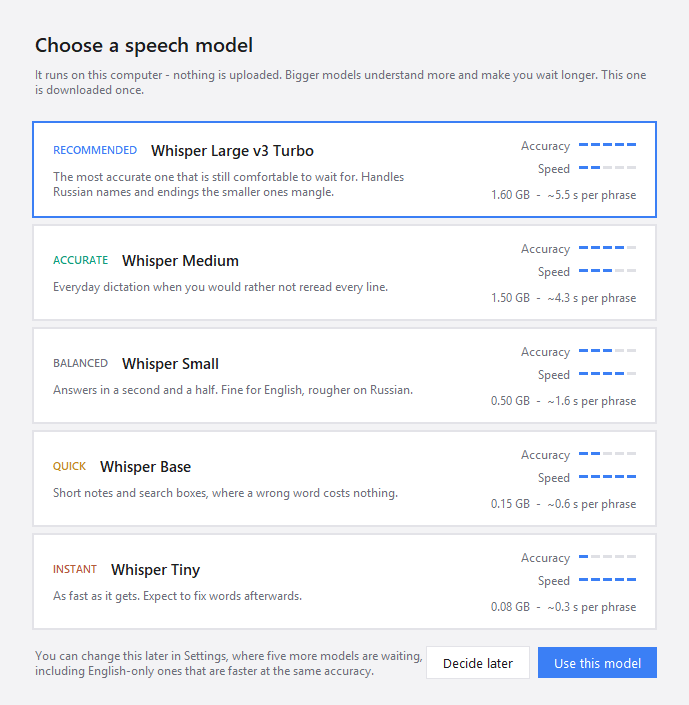

<p align="center">
  
</p>

<p align="center">
  <b>Dictation for Windows that runs on your own machine.</b><br>
  Press a key, speak, press it again - the text appears in whatever window you were typing in.
</p>

<p align="center">
  <a href="README.md"></a>
  <a href="README.ru.md"></a>
</p>

<p align="center">
  <a href="https://github.com/avl55-labs/fast-whisper/releases/latest">
    </a>
  <a href="https://github.com/avl55-labs/fast-whisper/releases">
    </a>
  <a href="LICENSE">
    </a>
  
  
</p>

<p align="center">
  <a href="#quick-start">Quick start</a> ·
  <a href="#choosing-a-model">Models</a> ·
  <a href="#for-organisations">For organisations</a> ·
  <a href="CHANGELOG.md">Changelog</a>
</p>

<p align="center">
  
</p>

## Quick start

1. Download the installer from [Releases][rel] and run it. No administrator rights, no UAC
   prompt.
2. On the first launch it asks which speech model to use. The recommended one is already
   picked.
3. Put your cursor where you want the text, press `Ctrl+Space`, say something, press it
   again. `Esc` throws a recording away.

The text is also left on the clipboard, so a paste that lands in the wrong window is not a
lost sentence.

## Why

Dictation is the fastest way to get a paragraph out of your head, and on Windows the good
tools for it are subscriptions that want an account and send your voice to their servers.

FastWhisper does the same job with none of that. Recognition runs on your own machine
through [faster-whisper][fw], so your voice never leaves the computer, there is nothing to
log in to, nothing to pay, and it keeps working with the network off.

|  | FastWhisper | Typical paid app |
| --- | --- | --- |
| Cost | free, MIT | $8-15 a month |
| Account | none | required |
| Your voice | stays on the machine | uploaded for recognition |
| Works offline | yes | no, or a weaker local mode |
| Windows domain deployment | MSI for Group Policy and Intune | rarely offered |
| macOS, iOS | no | usually yes |
| Cloud models, AI rewriting | no | usually yes |

The last two rows are the honest trade: this is a focused Windows tool, not a suite.

## What you get

| | |
| --- | --- |
| **One hotkey** | `Ctrl+Space` to toggle, or hold-to-talk. Any key or combination can be recorded, including bare `Right Ctrl`. |
| **A panel that shows the work** | A lattice of gold grains ripples with your voice, then changes pattern while the model transcribes. It never takes focus, and clicks pass through it. |
| **Ten models** | Whisper and Distil-Whisper, from Tiny at a third of a second per phrase to Large v3. Download and delete them in the app. |
| **Your words** | A vocabulary of names and jargon is fed to the model as context, so it stops mangling them. |
| **A history** | Everything recognized, searchable, one click to copy. |
| **English and Russian** | The interface follows Windows, and is separate from the language you dictate in. |

> Not affiliated with the `faster-whisper` library, with OpenAI, or with anyone else whose
> models it can run. FastWhisper is an application that uses open models under their own
> licences.

## Screenshots

<p align="center">
  
</p>
<p align="center"><i>The first launch asks which model to use, and what each one costs you.</i></p>

<p align="center">
  
</p>
<p align="center"><i>Settings: the hotkey, where the text goes, the panel, sounds, language.</i></p>

<p align="center">
  
</p>
<p align="center"><i>Models: who trained each one, how accurate it is, what it costs in disk and in waiting.</i></p>

## Choosing a model

Whisper runs its encoder over a fixed 30-second window, so the wait after you stop barely
depends on how long you spoke - a three-second phrase costs about as much as a nine-second
one. Measured on an 8-core Ryzen 9 8945HS, `int8`, 16 threads:

| Model | Size on disk | Wait per phrase | Quality |
| --- | --- | --- | --- |
| `base` | ~0.15 GB | ~0.6 s | rough, fine for short English notes |
| `small` | ~0.5 GB | ~1.6 s | decent, and the fastest that is usable |
| `medium` | ~1.5 GB | ~4.3 s | good, but Turbo beats it at a similar cost |
| `large-v3-turbo` | ~1.6 GB | ~5.5 s | best quality on CPU - the default |
| `large-v3` | ~3 GB | slower still | only worth it on a CUDA GPU |

On an NVIDIA GPU, set `device` to `cuda` and `compute_type` to `float16`: Turbo then
answers in well under a second and there is no reason to use anything smaller.

## Settings

The tray icon carries only what you need mid-dictation. Everything else is in the settings
window, on six pages: **General** (hotkey, language, model, where the text goes),
**Sound** (microphone, silence trimming, CPU threads), **Models**, **Vocabulary**,
**History** and **About**.

About the hotkey: a single key such as `Right Ctrl` is the most comfortable to hold and
keeps working as itself, but then every ordinary use of it opens the microphone. A
combination has only its last key swallowed - the modifiers are never touched - so pick
one nothing else wants.

Everything is written to `%APPDATA%\FastWhisper\config.json` as you change it. A few
options live only there:

| Key | Default | Meaning |
| --- | --- | --- |
| `hotkey` | `ctrl+space` | A key or combination: `f9`, `right ctrl`, `ctrl+alt+space`. |
| `mode` | `toggle` | `hold` (push-to-talk) or `toggle`. |
| `language` | `ru` | Recognition language, or `auto` to detect per recording. |
| `output` | `paste` | `paste`, `type` (character by character), or `clipboard`. |
| `device` | `cpu` | `cuda` with an NVIDIA card and the CUDA libraries installed. |
| `min_seconds` | `0.4` | Shorter recordings are discarded as accidental presses. |

Every option is commented in [`fastwhisper/config.py`](fastwhisper/config.py).

## Updates

FastWhisper can ask GitHub once a day whether a newer version exists, and tell you when
there is one. Nothing about you or your machine is sent, and nothing installs on its own:
you press a button, and the ordinary installer opens with its ordinary window. The
checkbox is offered on the first run and lives in *Settings → About*.

The MSI switches the check off for the whole machine, because on a managed network
versions change when the administrator says so.

## For organisations

FastWhisper has a per-machine MSI for Group Policy or Intune. It installs silently, with
no licences to count and no data leaving the machines.

> **Not published in 0.1.2.** The last released MSI is the one attached to
> [v0.1.0][rel]. Until the next one is published, build it yourself — see
> [Build from source](#build-from-source); it takes a couple of minutes and the payload
> is identical to the installer above.

```powershell
msiexec /i FastWhisper-x.y.z.msi /qn
msiexec /i FastWhisper-x.y.z.msi /qn AUTOSTART=1 MODELDIR="C:\ProgramData\FastWhisper\models"
msiexec /x FastWhisper-x.y.z.msi /qn
```

| Property | Effect |
| --- | --- |
| `AUTOSTART=1` | Starts FastWhisper for every user who signs in. |
| `MODELDIR=<path>` | One model directory for the machine instead of a copy per profile - half a gigabyte each. |
| `UPDATECHECK=1` | Lets users check for updates. Off by default in the MSI. |

Seed `MODELDIR` from a machine that already has the model and the application never
touches the network at all. Hotkeys, vocabulary and history stay per-user in `%APPDATA%`.

## Unsigned packages, and what Defender does about it

The packages are **not code-signed**. A certificate costs a few hundred dollars a year,
this project charges nobody anything, and there is no budget for one yet.

So SmartScreen warns about an unknown publisher, and Microsoft Defender sometimes decides
that an unsigned PyInstaller program is `Trojan:Win32/Wacatac` or `Trojan:Win32/Bearfoos`.
Both are false positives from a heuristic reacting to how the program is packaged rather
than to anything in it, and Defender may quarantine FastWhisper or stop it mid-run. Until
there is a signature, the answer is an exclusion - as an administrator:

```powershell
Add-MpPreference -ExclusionPath "$env:LOCALAPPDATA\Programs\FastWhisper"
```

| How it was installed | Folder to exclude |
| --- | --- |
| `FastWhisper-x.y.z-setup.exe` | `%LOCALAPPDATA%\Programs\FastWhisper` |
| `FastWhisper-x.y.z.msi` | `%ProgramFiles%\FastWhisper` |
| Built from source | `<repository>\dist\FastWhisper` |

Reporting a detection is what eventually clears it for everyone:
[submit the file to Microsoft](https://www.microsoft.com/en-us/wdsi/filesubmission) as a
false positive. Meanwhile, every line of source is here, each release lists the SHA-256 of
its files, and you can build and sign your own copy in a few minutes.

## Build from source

Requires Python 3.11+ and, for the installer, [Inno Setup 6][inno].

```powershell
git clone https://github.com/avl55-labs/fast-whisper
cd fast-whisper
powershell -ExecutionPolicy Bypass -File packaging\build.ps1
```

For the MSI as well, add [WiX 5][wix] and run the second script:

```powershell
dotnet tool install --global wix --version 5.0.2
powershell -ExecutionPolicy Bypass -File packaging\build-msi.ps1
```

To run it without building:

```powershell
py -3 -m venv .venv
.venv\Scripts\pip install -r requirements.txt
.venv\Scripts\pythonw -m fastwhisper
```

## Troubleshooting

- **The hotkey does nothing in one app.** Windows blocks keyboard hooks from processes at
  a lower integrity level. If that app runs as administrator, FastWhisper has to as well.
- **Text is not pasted.** Some apps ignore a synthetic `Ctrl+V`. Switch `output` to `type`.
- **Nothing is recognized.** Check the microphone under `input_device`; the log at
  `%APPDATA%\FastWhisper\fastwhisper.log` records every recording and its length.
- **Defender took the exe away.** See [above](#unsigned-packages-and-what-defender-does-about-it).

## Privacy

No telemetry, no analytics, no crash reporting, no account. Audio is held in memory and
discarded after recognition. Recognized text is appended to
`%APPDATA%\FastWhisper\history.jsonl` - set `save_history` to `false` to turn that off.

The application makes two kinds of network request, both refusable: downloading a speech
model, once, and the update check described above.

## License

MIT. See [LICENSE](LICENSE).

[fw]: https://github.com/SYSTRAN/faster-whisper
[inno]: https://jrsoftware.org/isinfo.php
[wix]: https://wixtoolset.org/
[rel]: https://github.com/avl55-labs/fast-whisper/releases
